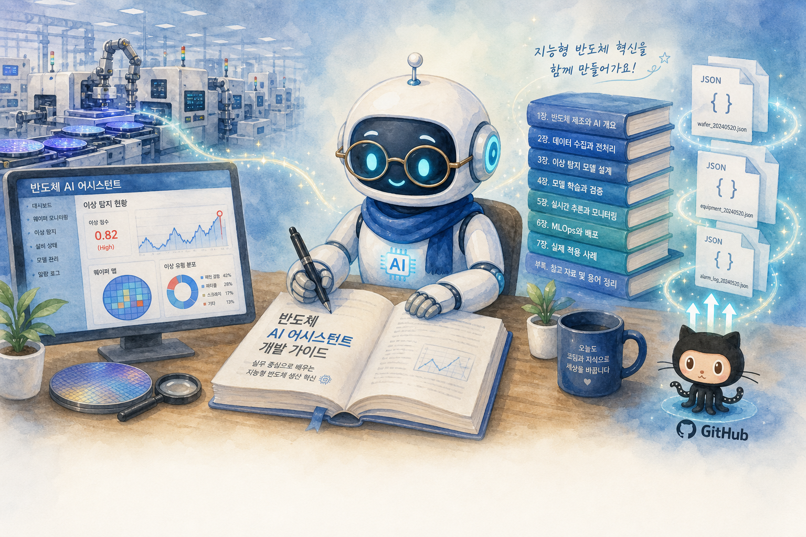

# 01_making_a_book — 반도체 플랫폼 기반 기술서 집필 에이전트

Google ADK + Ollama **gemma4:26b**로 [반도체 AI 어시스턴트](http://bigsoft.iptime.org:10200/) 플랫폼 데이터를 조사·인용해 **한국어** 기술 서적을 집필합니다.



**그림 설명:** ADK 에이전트가 반도체 플랫폼에서 이상감지·공정 이력 등 실제 데이터를 조사하고, Ollama LLM으로 한국어 기술서를 집필한 뒤 `output/`에 저장하고 GitHub에 올리는 흐름입니다.

## 어떻게 동작하나요?

1. `run.py`가 ADK 에이전트를 실행합니다.
2. 에이전트가 **플랫폼 API 도구**로 실시간 이상감지, 공정 이력, 리포트 등을 조사합니다.
3. **Ollama(gemma4:26b)** 가 조사 결과를 바탕으로 제목·목차·챕터 본문을 **한국어**로 작성합니다.
4. **책 저장 도구**가 `book_metadata.json`, `outline.json`, `chapters/*.md`로 저장합니다.
5. 저장할 때마다 Git **commit + push**가 자동 실행됩니다. (GPU 사용량은 `gpu_usage.csv`에 기록)

## 구조

```
01_making_a_book/
├── img/
│   └── overview.png  # 동작 개요 그림
├── agent/          # 실행 코드
│   ├── agent.py    # ADK root_agent
│   ├── run.py      # 실행 진입점
│   └── ...
├── output/         # 결과물
│   ├── agent.log
│   ├── book_metadata.json
│   ├── outline.json
│   └── chapters/
└── README.md
```

## 실행

```bash
cd /data1/github_cschae/adk-agent-lab/01_making_a_book/agent
export OLLAMA_API_BASE=http://localhost:11434
python3 run.py              # 자율 집필 (기본)
python3 run.py chat         # 대화형 CLI
python3 run.py sync         # 수동 commit+push
```

## 에이전트 도구

| 도구 | 설명 |
|------|------|
| `fetch_anomaly_logs` | 실시간 이상감지 |
| `fetch_prediction_logs` | 예측 이상감지 |
| `fetch_equipment_history` | 과거 공정 이력 |
| `list_platform_reports` | 리포트 목록 |
| `save_book_metadata` | 책 메타데이터 저장 |
| `save_outline` | 목차 저장 |
| `write_chapter` | 챕터 Markdown 저장 |

저장 시 `output/`에 결과가 쌓이고 자동으로 Git **commit + push** 됩니다.

## 로그

| 파일 | 내용 |
|------|------|
| `output/agent.log` | 도구 호출, git push 등 진행 로그 |
| `/tmp/agents_log/agent.latest.log` | ADK 내부 로그 |
