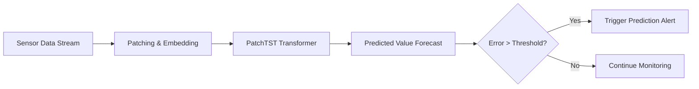

# 3. Chapter 3: Predictive Maintenance via PatchTST and Time-Series Forecasting

# Chapter 3: Predictive Maintenance via PatchTST and Time-Series Forecasting

In modern semiconductor manufacturing, reacting to an anomaly after it has occurred is often too late. A single excursion in an ALD (Atomic Layer Deposition) process can lead to the loss of an entire wafer lot, costing hundreds of thousands of dollars. To move from reactive to proactive management, we utilize advanced deep learning architectures, specifically **PatchTST (Patch Time Series Transformer)**, to predict future sensor values and identify deviations before they breach critical thresholds.

## 1. The Concept of Predictive Anomaly Detection

Traditional anomaly detection relies on "thresholding"—comparing the current value to a predefined Upper Control Limit (UCL) or Lower Control Limit (LCL). While effective for sudden spikes, it fails to capture gradual drifts or complex temporal patterns.

Predictive anomaly detection works by:
1.  **Modeling the Trend:** Using historical data to learn the "normal" trajectory of a parameter (e.g., MFC flow rate, pressure, temperature).
2.  **Generating Forecasts:** Predicting the value of the parameter for the next $N$ time steps.
3.  **Calculating Residuals:** Computing the error between the predicted value ($\hat{y}_t$) and the actual observed value ($y_t$).
4.  **Detecting Deviations:** If the error (residual) exceeds a certain statistical significance (e. overlap between prediction intervals), an alert is triggered.

## 2. Architecture: PatchTST for Semiconductor Sensors

The **PatchTST** model is particularly well-suited for semiconductor sensor data due to its ability to handle long-term dependencies and reduce computational complexity through "patching."

### 2.1 Patching Mechanism
Instead of treating each individual sensor reading as a single token (which is computationally expensive for high-frequency data), PatchTST groups adjacent time steps into **patches**. 
- **Benefit 1: Local Semantic Information.** Patches preserve the local shape of the waveform (e.g., the rise and fall of a gas pulse in ALD).
- **Benefit 2: Reduced Sequence Length.** By grouping $P$ time steps into one patch, the Transformer's attention mechanism processes a much shorter sequence, allowing for much longer historical context.

### 2.2 Transformer-based Forecasting
Each patch is embedded and passed through a Transformer encoder. The self-attention mechanism allows the model to understand how a pressure change at $T-100$ seconds relates to the current gas flow at $T=0$.

## 3. Real-world Case Study: MFC Flow Rate Prediction

Let's examine actual prediction logs from our platform to see how the model identifies "Forecast Deviations."

### 3.1 Data Analysis of a Prediction Alert

| Timestamp | Parameter | Actual Value | Predicted Value | Diff (%) | Violation Type |
| :--- | :--- | :--- | :--- | :--- | :--- |
| 2026-01-11 11:04:36 | **MFC4_N2-4** | 1.323 | 0.480 | **89.0%** | Upper Limit (U) |
| 2026-01-10 22:04:21 | **MFC8_NH3** | 5.592 | 4.500 | 18.98% | Upper Limit (U) |
| 2026-01-09 01:03:59 | **MFC3_N2-3** | -0.423 | 0.988 | **111.5%** | Lower Limit (L) |

#### Analysis of the MFC4_N2-4 Incident
On **January 11, 2026, at 11:04:36**, the platform detected a critical deviation in the $N_2$ flow rate.
- **The Observation:** The actual value jumped to **1.323 sccm**, whereas the PatchTST model predicted a much more stable **0.480 sccm**.
- **The Deviation:** A massive **89.0% error** was recorded.
- **The Context:** The violation occurred during the `pre-NH3P` step. While the value was still within the absolute physical limits (Upper: 0.7, Lower: -0.2), the *deviation from the expected trajectory* was so large that it indicated an impending instability in the mass flow controller (MFC) or a valve timing error.

### 3.2 Why This Matters for Engineers
If an engineer only looked at the absolute limit (0.7 sccm), they might have ignored this as a minor fluctuation. However, the **prediction-based alert** provides an early warning. This "residual-based" detection allows for:
- **Pre-emptive Valve Inspection:** Checking if the $N_2$ valve is sticking before it causes a total process abort.
- **Recipe Refinement:** Adjusting the pulse/purge timing in ALD to compensate for the observed drift in gas delivery.

## 4. Summary of Predictive Workflow

The following loop is executed continuously by the AI Assistant:

By leveraging PatchTST, we transform the monitoring paradigm from "Detecting the Fire" to "Detecting the Heat Increase."
