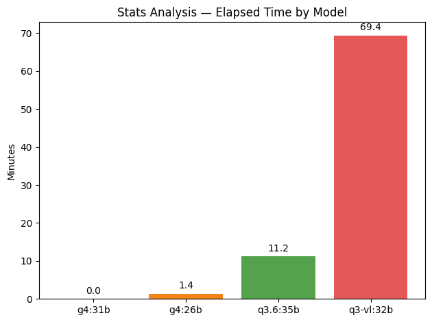
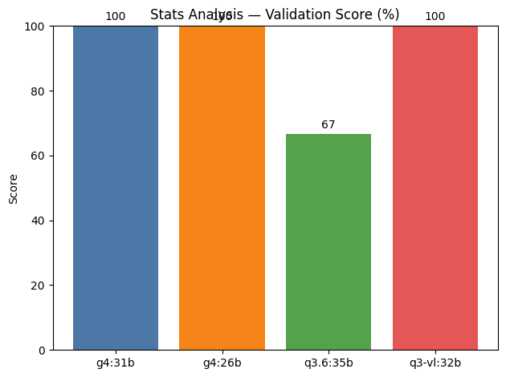
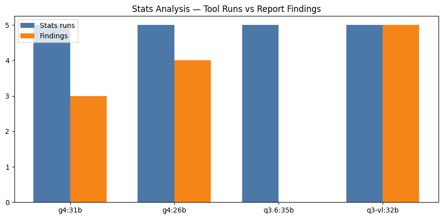

# 03_data_statistics — 모델별 통계 분석 비교

자동 생성: 2026-06-18 20:13:56

## 모델별 실행 결과

| 모델 | 상태 | 검증 점수 | 통계 Tool | 발견 | 소요 시간 | 출력 폴더 |
|------|------|-----------|-----------|------|-----------|-----------|
| `gemma4:31b` | ok | 100.0% | 5 | 3 | 0.1s | `gemma4_31b/` |
| `gemma4:26b` | ok | 100.0% | 5 | 4 | 83.6s | `gemma4_26b/` |
| `qwen3.6:35b` | failed | 66.7% | 5 | 0 | 673.7s | `qwen3_6_35b/` |
| `qwen3-vl:32b` | failed | 100.0% | 5 | 5 | 4164.7s | `qwen3_vl_32b/` |

## 비교 그래프

### 모델별 소요 시간 (분)

### 검증 점수 (%)

### 통계 Tool 실행 수 vs 리포트 발견 수

## `gemma4:31b` 검증 상세

- 완료: **예**
- 점수: 100.0%
- 리포트: `gemma4_31b/report.md`

## `gemma4:26b` 검증 상세

- 완료: **예**
- 점수: 100.0%
- 리포트: `gemma4_26b/report.md`

## `qwen3.6:35b` 검증 상세

- 완료: **아니오**
- 점수: 66.7%
- 미통과:
  - 차트 없음 (현재 0개)
  - report.md 없음
  - 주요 발견 3개 이상 필요 (현재 0개)
- 리포트: `qwen3_6_35b/report.md`

## `qwen3-vl:32b` 검증 상세

- 완료: **예**
- 점수: 100.0%
- 리포트: `qwen3_vl_32b/report.md`

## 참고

- 모델별 상세: `{slug}/profile.json`, `statistics.json`, `validation.json`
- GPU 시계열: `gpu_usage.csv`
- JSON 요약: `comparison_summary.json`
