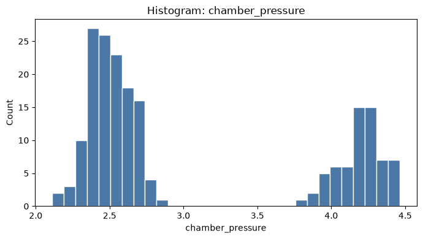
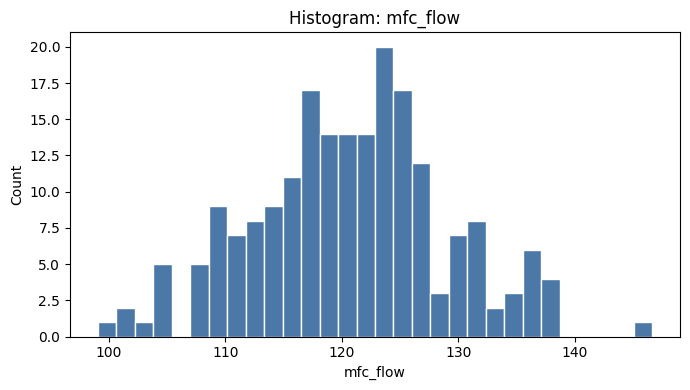
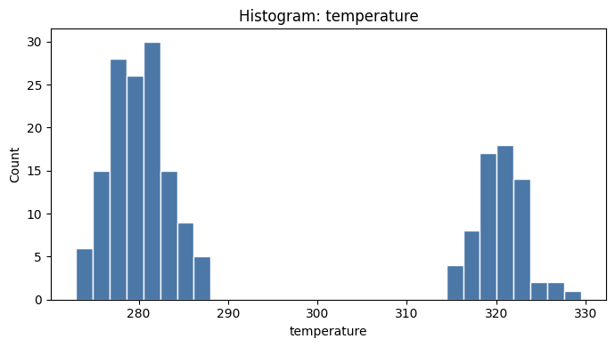

# gemma4:26b — 통계 분석 결과

자동 생성: 2026-06-19 15:36:27

## 실행 요약

| 항목 | 값 |
|------|-----|
| 모델 | `gemma4:26b` |
| 검증 점수 | 100.0% |
| 검증 완료 | 예 |
| 통계 Tool 실행 | 5회 |
| 차트 | 4개 |

## 데이터 개요

- 행 수: **200**
- 열 수: **7**
- 수치형: chamber_pressure, mfc_flow, temperature, is_anomaly
- 범주형: equipment_id, recipe
- 분석 힌트: datetime_column_detected, correlation_analysis_available, groupby_analysis_available

### 컬럼 프로파일

| 컬럼 | 종류 | 결측률(%) |
|------|------|-----------|
| `timestamp` | datetime | 0.0 |
| `equipment_id` | categorical | 0.0 |
| `recipe` | categorical | 0.0 |
| `chamber_pressure` | numeric | 3.0 |
| `mfc_flow` | numeric | 0.0 |
| `temperature` | numeric | 0.0 |
| `is_anomaly` | numeric | 0.0 |

## 기술통계 (descriptive_stats)

### `chamber_pressure`

| 지표 | 값 |
|------|-----|
| count | 194.0000 |
| mean | 3.0587 |
| std | 0.8103 |
| min | 2.1130 |
| 25% | 2.4515 |
| 50% | 2.5975 |
| 75% | 4.0940 |
| max | 4.4620 |

### `mfc_flow`

| 지표 | 값 |
|------|-----|
| count | 200.0000 |
| mean | 120.6637 |
| std | 8.3412 |
| min | 99.0400 |
| 25% | 115.4200 |
| 50% | 120.7950 |
| 75% | 125.5375 |
| max | 146.6400 |

### `temperature`

| 지표 | 값 |
|------|-----|
| count | 200.0000 |
| mean | 293.4099 |
| std | 19.3176 |
| min | 272.9700 |
| 25% | 278.7650 |
| 50% | 281.9400 |
| 75% | 318.9100 |
| max | 329.4900 |

## 상관계수 (correlation)

| | `chamber_pressure` | `mfc_flow` | `temperature` |
|---|---|---|---|
| `chamber_pressure` | 1.0000 | 0.1203 | 0.9711 |
| `mfc_flow` | 0.1203 | 1.0000 | 0.1334 |
| `temperature` | 0.9711 | 0.1334 | 1.0000 |

## 그룹별 집계 — `recipe` (mean)

| recipe | chamber_pressure | mfc_flow | temperature |
| --- | --- | --- | --- |
| ALD_SiO2_001 | 2.5052 | 119.6116 | 279.9157 |
| ALD_SiO2_002 | 2.4965 | 120.1628 | 280.1827 |
| PVD_TiN_010 | 4.1918 | 122.2403 | 320.5361 |

## 이상치 탐지 (IQR)

- 컬럼: `chamber_pressure`
- 이상치: 0건 (0.0%)
- 경계: -0.0122 ~ 6.5578

## 시각화

### correlation_heatmap

### hist_chamber_pressure

### hist_mfc_flow

### hist_temperature

## 검증 결과

- 점수: **100.0%** (9/9)

## LLM 리포트

상세 서술: [`report.md`](report.md)

## 원본 파일

- [`profile.json`](profile.json)
- [`statistics.json`](statistics.json)
- [`validation.json`](validation.json)
