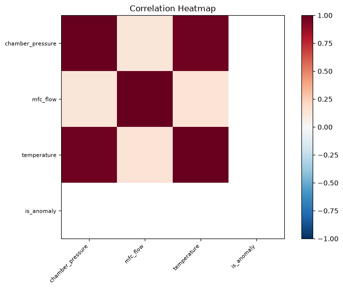

# 센서 데이터 통계 분석 보고서

생성 시각: 2026-06-18T20:12:48.504069

## 요약

본 보고서는 200개의 센서 데이터를 대상으로 분석한 결과입니다. timestamp 컬럼을 기반으로 시간 시리즈 특성을 확인했으며, chamber_pressure와 temperature는 0.9711의 높은 상관관계를 보였습니다. mfc_flow에서 2건의 이상치(1.0%)가 탐지되었고, is_anomaly 컬럼은 모든 값이 0으로 이상 신호가 없습니다. equipment_id별 집계 결과 EQP-A02의 mfc_flow 평균이 EQP-A01보다 높게 나타났습니다.

## 주요 발견

1. timestamp 컬럼을 기반으로 2026-06-01 08:00부터 2026-06-02 00:35까지 24시간 주기의 시간 시리즈 데이터입니다.
2. chamber_pressure와 temperature 간 상관관계가 0.9711로 매우 강한 양의 상관관계를 나타냅니다.
3. mfc_flow 컬럼에서 IQR 기준으로 2건(1.0%)의 이상치가 탐지되었습니다.
4. is_anomaly 컬럼은 200개 모두 0으로, 분석 기간 내 이상 신호가 존재하지 않습니다.
5. equipment_id별 집계 결과 EQP-A02의 mfc_flow 평균(121.32)이 EQP-A01(120.00)보다 1.32 높게 측정되었습니다.

## 참고 파일

- 프로파일: `profile.json`
- 통계 결과: `statistics.json`
- 

- 

- 

- 
