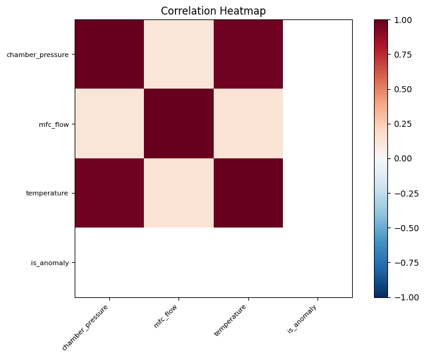
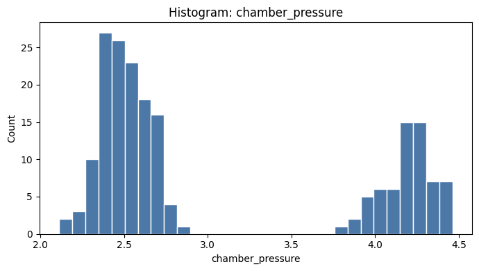

# 샘플 센서 데이터 통계 분석 (Tool 테스트)

생성 시각: 2026-06-18T18:27:24.098574

## 요약

Tool smoke test로 자동 생성된 리포트입니다.

## 주요 발견

1. 행 수: 200, 열 수: 7
2. 수치형 컬럼: chamber_pressure, mfc_flow, temperature, is_anomaly
3. 분석 힌트: datetime_column_detected, correlation_analysis_available, groupby_analysis_available

## 참고 파일

- 프로파일: `profile.json`
- 통계 결과: `statistics.json`
- 

- 

- 

- 
