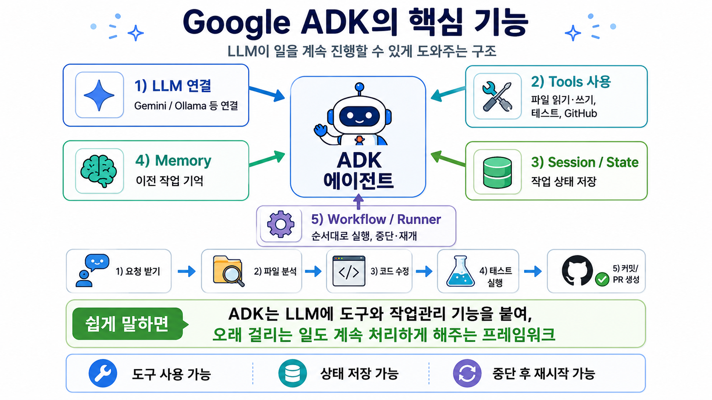
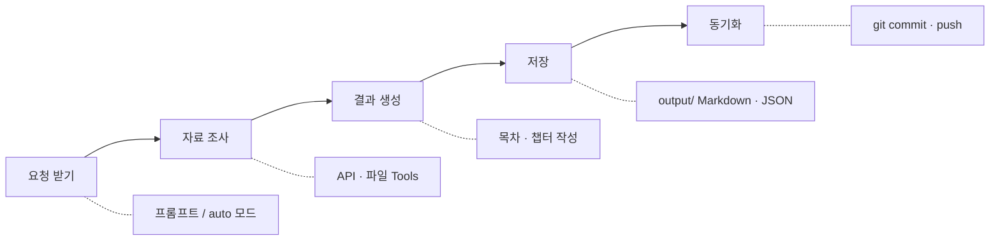
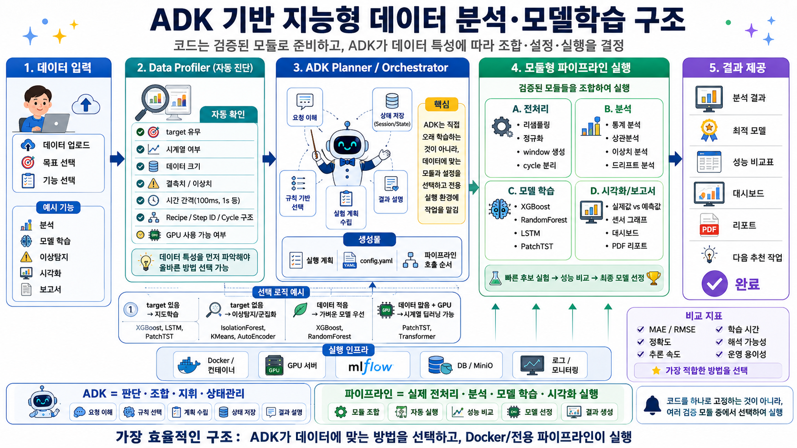
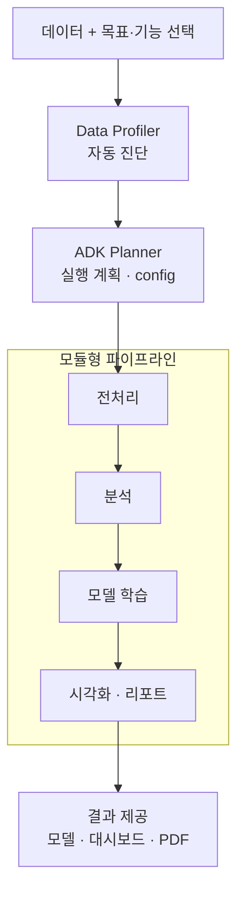
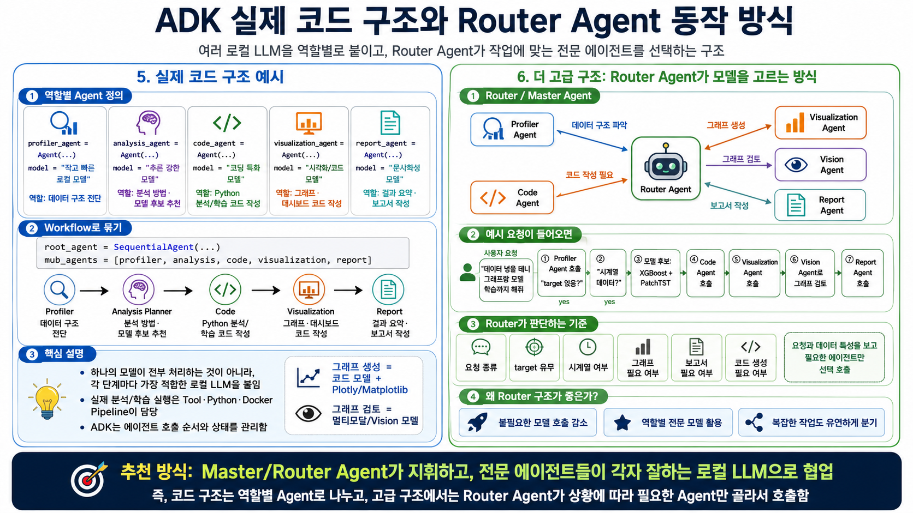
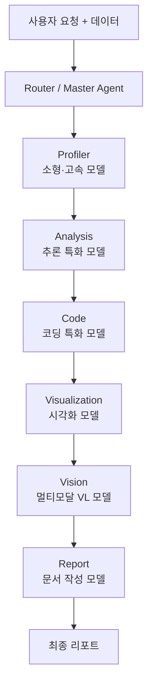
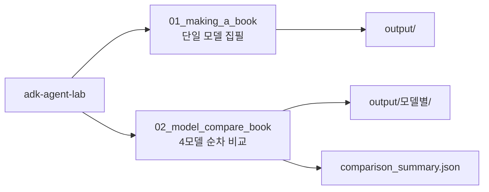

# adk-agent-lab

Google ADK(Agent Development Kit) 기반 로컬 LLM 에이전트 실험실입니다.  
기능별로 번호가 붙은 프로젝트 폴더 안에 **코드(`agent/`)** 와 **결과물(`output/`)** 을 함께 둡니다.

## Google ADK란?

ADK는 LLM에 **도구(Tools)** 와 **작업 관리** 기능을 붙여, 단순 대화를 넘어 여러 단계에 걸친 작업을 이어서 처리하게 해 주는 프레임워크입니다. 이 레포의 에이전트들도 같은 구조 위에서 동작합니다.



### 핵심 구성 요소

| 구성 | 설명 | 이 레포에서의 예 |
|------|------|------------------|
| **LLM 연결** | Gemini, Ollama 등 다양한 모델 연동 | `LiteLlm` + Ollama `gemma4`, `qwen3` 등 |
| **Tools** | 파일 저장, API 호출, Git 동기화 등 실제 동작 | 플랫폼 API 조회, 챕터 저장, `git commit/push` |
| **Session / State** | 작업 진행 상태 유지 | ADK 세션·책 메타데이터·목차·챕터 파일 |
| **Memory** | 이전 맥락 기억 | 세션 내 대화·도구 호출 결과 활용 |
| **Workflow / Runner** | 순차 실행, 중단·재개 | `run.py` → `adk run`, 모델별 순차 집필 |

### 일반적인 작업 흐름



1. **요청 받기** — 사용자 프롬프트 또는 `auto` 모드 자율 집필 지시
2. **자료 조사** — 플랫폼 API·파일 등 도구로 데이터 수집
3. **결과 생성** — 목차·챕터 본문 작성
4. **저장** — `output/`에 Markdown·JSON 기록
5. **동기화** — GitHub에 commit·push (선택)

ADK의 강점은 **도구 사용**, **상태 저장**, **중단 후 재시작**입니다. 책 집필처럼 시간이 걸리고 단계가 많은 작업에 특히 잘 맞습니다.

## 확장 아키텍처 (로드맵)

이 레포는 아래 두 가지 방향으로 확장할 수 있습니다. (현재 구현: `01_making_a_book`, `02_model_compare_book`)

### 기능별 전용 에이전트 + 자동 파이프라인



**데이터 분석·모델 학습·시각화**처럼 기능마다 **전용 ADK 에이전트**를 두고, 사용자는 원하는 기능을 고른 뒤 **데이터만 넣으면** 나머지는 자동으로 진행되는 구조입니다.



1. 데이터 업로드 + 목표·기능 선택 (분석 / 학습 / 이상감지 / 시각화 / 리포트)
2. **Data Profiler**가 데이터 특성 자동 진단 (시계열 여부, 결측치, GPU 등)
3. **ADK Planner**가 적합한 모듈·설정을 골라 실행 계획 수립
4. 전처리 → 분석 → 모델 학습 → 시각화·리포트 **모듈형 파이프라인** 실행
5. 최적 모델, 성능 비교표, 대시보드·PDF 등 **결과 제공**

ADK는 직접 학습을 수행하기보다, **어떤 모듈을 어떤 순서로 돌릴지 판단·조율**하는 역할을 합니다.

### 한 에이전트 + 역할별 로컬 LLM (Router 방식)



로컬 Ollama 모델 여러 개를 **한 작업 흐름 안에서 역할에 맞게 바꿔 쓰는** 방식입니다. 예: 데이터를 넣으면 자동 분석 에이전트가 동작할 때,



| 역할 | 담당 모델 예시 | 하는 일 |
|------|----------------|---------|
| **Profiler** | 소형·고속 모델 | 데이터 구조·특성 진단 |
| **Analysis** | 추론 특화 모델 | 분석 방법·모델 후보 추천 |
| **Code** | 코딩 특화 모델 | 분석·학습 Python 코드 작성 |
| **Visualization** | 코드/시각화 모델 | Plotly·Matplotlib 그래프 생성 |
| **Vision** | 멀티모달(VL) 모델 | 생성된 그래프 품질 검수 |
| **Report** | 문서 작성 모델 | 결과 요약·리포트 작성 |

**Router(Master) 에이전트**가 요청과 데이터를 보고 필요한 하위 에이전트만 순서대로 호출합니다.  
`02_model_compare_book`은 동일 주제에 **모델 전체를 바꿔가며** 성능을 비교하는 실험이고, 위 구조는 **한 작업 안에서 단계마다 다른 모델**을 쓰는 확장 형태입니다.

## 레포 구조

```
adk-agent-lab/
├── img/
│   ├── adk.png                                      # ADK 핵심 기능
│   ├── ADK_기반_지능형_데이터_분석_모델학습_구조.png   # 기능별 전용 에이전트·파이프라인
│   └── 실제_코드_구조와_동작_방식.png                  # Router + 역할별 로컬 LLM
├── 01_making_a_book/
│   ├── agent/          # 실행 코드
│   ├── output/         # 결과물
│   └── README.md
├── 02_model_compare_book/
│   ├── agent/          # 실행 코드
│   ├── output/         # 모델별 결과물
│   └── README.md
└── requirements.txt
```

## 설치

```bash
cd /data1/github_cschae/adk-agent-lab
pip install -r requirements.txt
```

## 프로젝트 목록



| 폴더 | 설명 |
|------|------|
| [01_making_a_book](01_making_a_book/) | 반도체 플랫폼 데이터 기반 한국어 기술서 집필 |
| [02_model_compare_book](02_model_compare_book/) | Ollama 멀티모델 순차 집필·성능 비교 |
